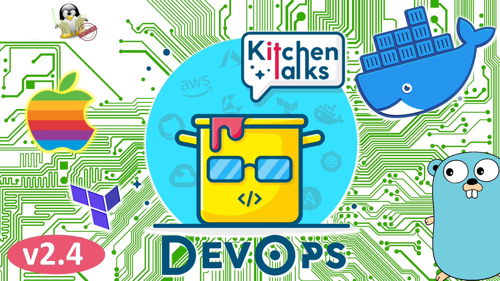

Саша уже не первый месяц пользуется Mac Pro на М1 и рассказал нам свой опыт работы, что работает, а что еще не очень. 8 гигов или 16, подождать М2 или срочно нужно все брасать и бежать в магазин . Саша в деталях рассказал как работает terraform, kubectl, git и другие консольные утилиты.  

Гугл признал сложность кубернетеса и на момент показалось решил его закрыть, а вот и нет. Представили новый продукт - автопилот для GKE. Погрузил свои контейнеры и автопилот их увезет в закат или на прод, как уже решит. Какие ограничение у автопилота?  

И на горячее - опять темы сертификации. Саша поделился опытом сдачи #terraformcertified от Hashi Corp сертификации, Витя рассказал про #Linux Foundation сертификацию - админ и инженер.  
Как сертификацию выбрать, если только начинаешь или уже думаешь что познал все в линуксе.

# Timing:
03:02 - Государственный майнинг (https://habr.com/ru/news/t/544362/)  
07:55 - Саша делится опытом работы на M1  
41:30 - Новый Беларусский клауд (https://dev.by/news/iba-group-zapustila-oblachnogo-provaidera)  
47:11 - CDK For Terraform released (https://www.hashicorp.com/blog/announcing-cdk-for-terraform-0-1)  
01:02:30 - Новости одной строкой  
01:14:22 - Terraform и Linux сертификации

# Сказать спасибо:
https://www.patreon.com/devopskitchentalks

# Музыка:
https://www.bensound.com/