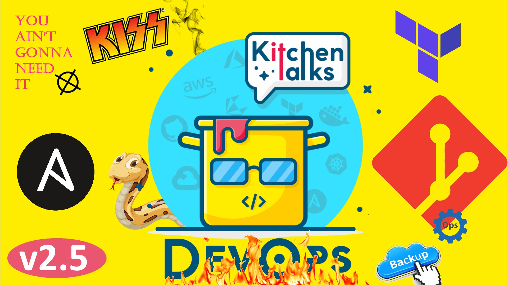

Секретное окружение  - все гениальное просто - это принципы разработки: KISS, DRY, YAGNI, BDUF, SOLID, APO и бритва Оккама. 
Они поднимут качество твоего кода на новый уровень, мы все про них слышали мельком, но не разбирали глубоко или просто игнорировали. А мы решили в деталях разобрать, а как именно для DevOps мира применимы это принципы, и что из этого применима если ты yaml-developer. (не) новый релиз Ansible 3.0 - и почему же он не новый, или все же большой новый релиз. Отмечаем день рождения 
Python - 30 лет, отмечая юбилей  PyPi удалили почти 4К вредоносных пакетов. Все это и не только 19-ом выпуске. 

# Timing:
03:24 - Уязвимость в Git (https://www.openwall.com/lists/oss-security/2021/03/09/3)  
10:35 - Ansible 3.0 (https://www.ansible.com/blog/announcing-the-community-ansible-3.0.0-package)  
19:29 - Принципы для разработки (https://habr.com/ru/company/itelma/blog/546372/)  
51:38 - 30 лет питону (https://www.theregister.com/2021/02/20/python_at_30/)  
54:47 - 3,653 уязвимости в PyPI (https://www.theregister.com/2021/03/02/python_pypi_purges/)  
58:00 - Подпиши свой код(https://www.theregister.com/2021/03/09/sign_of_the_primes_linux/)  
01:03:45 - Backup and in the Age of GitOps and CI/CD Deployments (https://dzone.com/articles/backup-and-disaster-recovery-in-the-age-of-gitops)  
01:26:50 - Don’t Deploy Applications with Terraform (https://medium.com/google-cloud/dont-deploy-applications-with-terraform-2f4508a45987)  

# Сказать спасибо:
https://www.patreon.com/devopskitchentalks

# Музыка:
https://www.bensound.com/